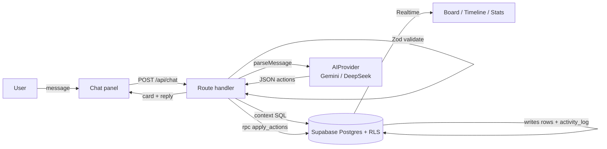

# Loggy — Architecture

Loggy is a single-user, chat-first project manager: a chat message goes to an AI that returns **JSON actions only**, the server validates them, one Postgres function applies them atomically and logs every change, and Supabase Realtime refreshes the board, timeline and stats.

Source of product truth: [PRD.md](PRD.md) (copy of the "PRD: Loggy" claude.ai artifact). This file is the source of technical truth. When they disagree, ask, then update one of them.

---

## 1. At a glance



Hard boundaries:

| Boundary | Rule |
| --- | --- |
| AI → DB | The AI never touches the DB. It returns JSON; the server validates and executes. |
| Writes | Every data change (chat, manual drag, undo) goes through one Postgres function, so `activity_log` is always written. |
| Numbers | Counts, rates and recaps' raw rows come from SQL. The AI only phrases summaries. |
| Secrets | AI keys live server-side only. No `NEXT_PUBLIC_` prefix on anything secret. |
| Access | Every table has `user_id` + RLS. The app uses the user's session, never the service-role key. |

---

## 2. Stack

| Layer | Choice | Package(s) |
| --- | --- | --- |
| Framework | Next.js (App Router, TypeScript strict, `src/` dir) | `next`, `react` |
| Styling / UI | Tailwind CSS + shadcn/ui | `tailwindcss`, shadcn CLI |
| Drag and drop | dnd-kit | `@dnd-kit/core`, `@dnd-kit/sortable` |
| Charts | Recharts | `recharts` |
| PWA | Serwist (Turbopack route-handler setup) | `@serwist/turbopack`, `serwist` |
| DB / auth / realtime | Supabase (local via CLI, cloud for prod) | `@supabase/supabase-js`, `@supabase/ssr`, `supabase` (CLI, dev dep) |
| Validation | Zod | `zod` |
| AI | Gemini first, DeepSeek later, behind `AIProvider` | `@google/genai` |
| Tests | Vitest (unit), pgTAP or SQL scripts via Supabase CLI (DB) | `vitest` |
| Package manager | pnpm | |
| Hosting | Vercel Hobby + Supabase Free | |

Library APIs move fast. Before wiring Serwist, `@supabase/ssr` or `@google/genai`, check current docs (context7) instead of relying on memory.

---

## 3. Folder structure

```
loggy/
├─ CLAUDE.md                     # agent rules (read first)
├─ docs/
│  ├─ PRD.md                     # product requirements (FR-x ids)
│  ├─ ARCHITECTURE.md            # this file
│  └─ TASKS.md                   # ordered build tickets
├─ supabase/
│  ├─ config.toml
│  ├─ migrations/                # 0001_schema.sql, 0002_rls.sql, ... (never edit an applied one)
│  └─ tests/                     # SQL tests for RLS + apply_actions + undo
├─ evals/
│  ├─ fixtures/context.json      # fake projects/tasks for AI evals
│  ├─ messages.jsonl             # 20+ messages with expected actions (Phase 2 gate)
│  └─ run.ts                     # `pnpm eval`
├─ src/
│  ├─ app/
│  │  ├─ (auth)/login/page.tsx
│  │  ├─ auth/callback/route.ts
│  │  ├─ (app)/layout.tsx        # shell: chat | views
│  │  ├─ (app)/page.tsx          # board (default view)
│  │  ├─ (app)/timeline/page.tsx
│  │  ├─ (app)/stats/page.tsx
│  │  ├─ (app)/settings/page.tsx
│  │  ├─ api/chat/route.ts       # POST: message -> actions -> card
│  │  ├─ api/undo/route.ts       # POST: { messageId }
│  │  ├─ manifest.ts             # PWA manifest
│  │  ├─ sw.ts                   # service worker source
│  │  └─ serwist/[path]/route.ts # Serwist route handler
│  ├─ components/
│  │  ├─ chat/                   # ChatPanel, MessageList, ChatInput, ActionCard
│  │  ├─ board/                  # Board, Column, TaskCard, TaskSheet
│  │  ├─ timeline/
│  │  ├─ stats/
│  │  └─ ui/                     # shadcn generated
│  ├─ lib/
│  │  ├─ supabase/               # client.ts (browser), server.ts (RSC/route), proxy.ts (session refresh)
│  │  ├─ db/types.ts             # generated: supabase gen types
│  │  ├─ db/queries.ts           # typed reads (context, board, timeline, stats)
│  │  ├─ ai/actions.ts           # Zod action schema + JSON Schema export
│  │  ├─ ai/provider.ts          # AIProvider interface + factory (env AI_PROVIDER)
│  │  ├─ ai/providers/gemini.ts
│  │  ├─ ai/providers/mock.ts    # deterministic, for tests and offline dev
│  │  ├─ ai/context.ts           # builds the minimal context
│  │  ├─ ai/prompt.ts            # static system prompt (versioned const)
│  │  ├─ chat/handle-message.ts  # orchestration used by /api/chat
│  │  ├─ chat/executor.ts        # reference checks + rpc apply_actions + card summary
│  │  ├─ chat/query.ts           # pending / completed / recap SQL + summarize call
│  │  └─ realtime/use-live.ts    # subscribe + invalidate
│  └─ proxy.ts                   # auth guard (Next 16 name; `middleware.ts` on Next 15)
└─ .env.example
```

---

## 4. Chat request flow

`POST /api/chat { content }` → `handleMessage()`:

1. **Auth.** Get user from the server Supabase client. No user → 401.
2. **Save user message** in `chat_messages` (role `user`).
3. **Build context** (`ai/context.ts`):
   - active projects: `id, name, workspace`
   - open tasks: `id, title, project_id`, newest first, cap 100
   - last 5 chat messages (role + content)
   - today's date in `APP_TIMEZONE`
   - private workspaces: task title cut to 40 chars, no notes, no description
   - never: completed tasks, activity history
4. **Call AI**: `provider.parseMessage(context, content)` → raw JSON. Timeout 10 s, 2 retries with backoff on 429/5xx.
5. **Validate** with Zod (`ParseResultSchema`). Invalid → save assistant error message, write nothing, return `{ error, retryable: true }`.
6. **Branch on actions:**
   - `clarify` (alone) → save assistant message with the question. No writes.
   - `query` (alone) → `chat/query.ts` runs SQL, second short AI call summarizes rows → save reply. No writes.
   - mutations → `chat/executor.ts`:
     1. check every referenced `project_id` / `task_id` exists in this user's open context; unknown id → treat as invalid, write nothing
     2. `rpc('apply_actions', { p_message_id, p_actions })` — one transaction
     3. build card summary from the RPC result: `{ done: 1, added: 2, updated: 0, ... , items: [...] }`
7. **Save assistant message** with `content = reply`, `actions = validated actions`, `result = card`, `latency_ms`.
8. **Return** `{ message, card }`. Views update through Realtime, not through this response.

Budget per message: under 2,500 input and 300 output tokens; reply + card in under 3 s.

---

## 5. Data model

Postgres in Supabase. IDs are `bigint generated by default as identity` (short integers keep AI context cheap; "by default" lets undo re-insert a deleted row with its old id).

Every table has `user_id uuid not null default auth.uid() references auth.users on delete cascade`.

| Table | Columns (beyond `id`, `user_id`) | Notes |
| --- | --- | --- |
| `workspaces` | `name text` (`Office` / `Personal`), `is_private bool default false`, `created_at` | Two rows seeded by trigger on `auth.users` insert |
| `projects` | `workspace_id`, `name text`, `description text`, `status project_status` (`active`, `paused`, `done`, `archived`), `created_at`, `updated_at` | Unique `(user_id, lower(name))`; AI matches on name |
| `tasks` | `project_id` (cascade), `title`, `status task_status` (`todo`, `in_progress`, `done`), `priority task_priority` (`low`, `medium`, `high`, default `medium`), `due_date date`, `estimate_hours numeric(5,2)`, `notes text`, `links text[] default '{}'`, `position double precision`, `created_at`, `updated_at`, `completed_at` | Flat, no subtasks. `position` orders cards within a column |
| `chat_messages` | `role` (`user` / `assistant`), `content text`, `actions jsonb`, `result jsonb` (card), `status` (`ok`, `clarify`, `query`, `error`), `undone_at timestamptz`, `latency_ms int`, `created_at` | Links a message to the changes it caused |
| `activity_log` | `entity_type` (`project` / `task`), `entity_id bigint`, `action text`, `before jsonb`, `after jsonb`, `message_id` (nullable FK), `source` (`chat`, `manual`, `undo`), `created_at` | One row per change. `before` makes undo possible. Powers timeline, recap, task history |

Indexes: `tasks (user_id, status)`, `tasks (project_id)`, `activity_log (user_id, created_at desc)`, `activity_log (entity_type, entity_id)`, `chat_messages (user_id, created_at desc)`.

RLS on every table: `using (user_id = auth.uid()) with check (user_id = auth.uid())` for select/insert/update/delete. Realtime publication includes `projects`, `tasks`, `activity_log`, `chat_messages`.

### Database functions (all `security invoker`, so RLS still applies)

| Function | Does |
| --- | --- |
| `apply_actions(p_message_id bigint, p_actions jsonb, p_source text default 'chat') returns jsonb` | Loops actions in order inside one transaction. Resolves `project_ref` from projects created earlier in the same call. Each change writes the row and an `activity_log` row with `before` / `after`. Any error rolls back everything. Returns per-action results with ids. Manual board edits call it too, with `p_source = 'manual'` and `p_message_id = null` |
| `undo_message(p_message_id bigint) returns jsonb` | Reads that message's `activity_log` rows newest first and reverts each (`create` → delete, `update`/`complete` → restore `before`, `delete` → re-insert `before`). Logs reverts with `source = 'undo'`, sets `chat_messages.undone_at`. Refuses if already undone, or if a later change touched the same entity (return a conflict, the UI says so) |
| `project_stats(p_workspace_id bigint default null)` | Per project: open vs done count, completion rate, estimated hours open vs done |
| `tasks_done_per_week(p_weeks int default 8)` | Done count per ISO week per project, from `tasks.completed_at` |
| `activity_between(p_from timestamptz, p_to timestamptz, p_project_id bigint default null)` | Rows for timeline and recap queries |

---

## 6. AI layer

### `AIProvider`

```ts
export interface AIProvider {
  parseMessage(ctx: AIContext, message: string): Promise<unknown>; // raw JSON, validated by caller
  summarize(question: string, rows: unknown[]): Promise<string>;   // short recap text
}
export function getProvider(): AIProvider; // switch on process.env.AI_PROVIDER: 'gemini' | 'deepseek' | 'mock'
```

Model id comes from `AI_MODEL`, never hardcoded. Gemini adapter: JSON response with the action JSON Schema, thinking budget at minimum, low temperature, static system prompt first (cache-friendly), dynamic context after it.

### Action schema (`lib/ai/actions.ts`)

Response: `{ actions: Action[], reply: string }`. `Action` is a Zod discriminated union on `type`:

| `type` | Fields |
| --- | --- |
| `create_project` | `ref?` (temp key like `"p1"`), `name`, `workspace` (`office` / `personal`), `description?` |
| `update_project` | `project_id`, `name?`, `description?`, `status?` |
| `create_task` | `project_id` **or** `project_ref`, `title`, `status?`, `priority?`, `due_date?` (YYYY-MM-DD), `estimate_hours?`, `notes?` |
| `update_task` | `task_id`, `title?`, `status?`, `priority?`, `due_date?`, `estimate_hours?`, `project_id?` |
| `complete_task` | `task_id` |
| `delete_task` | `task_id` |
| `add_note` | `task_id`, `note` (appended to `notes` with a date prefix) |
| `add_link` | `task_id`, `url` |
| `query` | `kind` (`pending`, `completed`, `recap`), `project_id?`, `workspace?`, `from?`, `to?` |
| `clarify` | `question` |

Rules enforced in Zod `superRefine`: `query` and `clarify` must be the only action; `create_task` needs exactly one of `project_id` / `project_ref`; every `project_ref` must match an earlier `create_project.ref`; max 10 actions.

Export the JSON Schema from the same Zod source (`z.toJSONSchema`) so prompt, provider and validator never drift. If a provider rejects `anyOf`, send a flat schema (all fields optional) and let Zod do the strict check.

### System prompt (`lib/ai/prompt.ts`)

Static, versioned (`PROMPT_VERSION`), stored in `chat_messages.actions` metadata for debugging. It states: output JSON only; pick ids from context only; ask `clarify` when project or task is ambiguous instead of guessing; infer workspace from words like "office", "client", "side project"; resolve relative dates against today; keep `reply` under 20 words.

---

## 7. Views and realtime

| View | Data | Notes |
| --- | --- | --- |
| Board (FR-7/8/9) | `tasks` + `projects` filtered by workspace/project (URL search params) | Archived projects hidden. Drag between columns calls a server action that runs `apply_actions` with `source='manual'` |
| Task sheet (FR-8) | task row + its `activity_log` rows | Notes, estimate, links, due date, history |
| Timeline (FR-10) | `activity_between`, grouped by day in `APP_TIMEZONE` | Reverse chronological, project filter |
| Stats (FR-11/12) | `project_stats`, `tasks_done_per_week` | Recharts. No AI involvement |
| Basic list (Phase 2 only) | open tasks grouped by project | Temporary, replaced by Board in Phase 3 |

Realtime: one hook `useLive(tables)` subscribes to `postgres_changes` on the user's rows and calls `router.refresh()` (or invalidates client state). Target: views update within 1 s of a change.

Layout: desktop = chat left (~380 px) + views right with tabs. Mobile (< 768 px) = chat full screen with a bottom tab bar to switch to Board / Timeline / Stats; chat input pinned at bottom.

---

## 8. Auth and single-user lock

- Supabase magic link. `/auth/callback` exchanges the code for a session (`@supabase/ssr`).
- `src/proxy.ts` refreshes the session and redirects signed-out users to `/login`.
- Single user: disable open sign-ups in Supabase, and the login action rejects any email not equal to `ALLOWED_EMAIL`.
- Workspace seeding: trigger `on auth.users insert` creates Office and Personal.

---

## 9. Environment variables

| Name | Where | Purpose |
| --- | --- | --- |
| `NEXT_PUBLIC_SUPABASE_URL` | client + server | Supabase project URL |
| `NEXT_PUBLIC_SUPABASE_ANON_KEY` | client + server | Public anon / publishable key (RLS protects data) |
| `ALLOWED_EMAIL` | server | The one email allowed to log in |
| `AI_PROVIDER` | server | `gemini` \| `deepseek` \| `mock` |
| `AI_MODEL` | server | Model id for the chosen provider |
| `GEMINI_API_KEY` | server | Gemini key |
| `DEEPSEEK_API_KEY` | server | Later |
| `APP_TIMEZONE` | server | IANA zone for "today", day grouping, weeks (e.g. `Asia/Jakarta`) |

`.env.example` lists all names with empty values. Real values go in `.env.local` (git-ignored) and Vercel project settings.

---

## 10. Key decisions

| Decision | Why | Rejected |
| --- | --- | --- |
| Apply actions in one Postgres function | All-or-nothing writes and guaranteed `activity_log` rows; supabase-js has no multi-statement transactions | TS executor with manual compensation |
| Integer ids | Cheaper tokens in AI context, easier for the model to copy | UUIDs |
| `project_ref` temp keys | Lets one message create a project and its tasks | Two round trips to the AI |
| Same write path for manual edits | Timeline and undo stay complete | Direct table updates from the UI |
| Stats and recap rows in SQL | Exact numbers, no token cost | Asking the AI to count |
| Mock provider | Tests and UI work without network or quota | Calling Gemini in tests |
| User session + RLS everywhere | No service-role key to leak | Admin client in routes |
