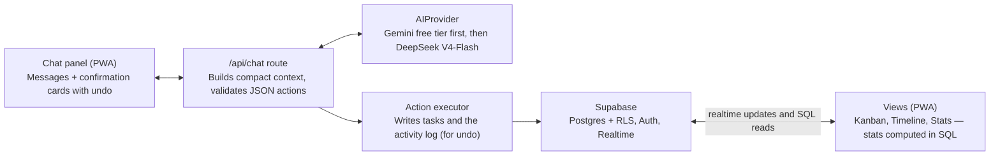
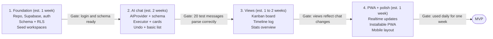

# PRD: Loggy

2026-10-04 · Byan

> Repo copy of the PRD artifact ([claude.ai](https://claude.ai/artifact/1q9ZXWM8bfpTTM9XdhVf1P)), copied 2026-10-05 at doc revision 22. The artifact is the original; if it changes, re-copy this file. Diagrams are redrawn as Mermaid.

## Overview

Loggy is a personal project manager where chat is the only input and the board is the output. You describe your work in plain language, and the AI creates, updates and completes tasks for you.

**Problem.** Tools like Trello and ClickUp work well once data is in them, but filling forms and dragging cards takes effort. That friction means the board goes stale, and history is lost.

**Solution.** A chat panel sits beside an auto-updating kanban board, timeline and stats view. A message like "finished the login API for Alpha, next is tests and the CORS bug" becomes one completed task and two new ones.

**Goals**

- Logging work takes one chat message, under 10 seconds.
- The board, history and stats stay accurate without manual editing.
- Questions like "what did I do last week?" get an answer in one reply.
- AI running cost stays under $5 per month.

## Target user and use cases

The only user is you: a software engineer juggling office projects and personal side projects. There are no team, sharing or client features in v1.

| Use case | Example message | What the app does |
| --- | --- | --- |
| Log progress | "Done with the auth refactor for Alpha" | Moves the task to Done and records it in history |
| Plan next work | "Next I need to write tests and fix CORS" | Creates two tasks in the active project |
| Add details | "Note on CORS task: only on Safari, estimate 3h" | Attaches a note and estimate to the task |
| Start a project | "New side project: habit tracker app" | Creates a project in the Personal workspace |
| Recap | "What did I finish this week?" | Summarizes completed tasks by project |
| Check status | "What's pending for office work?" | Lists open tasks, grouped by project |

## Scope

The MVP covers chat input, three views and a single-user PWA. Everything else waits until the core loop proves useful day to day.

**In scope (MVP)**

- Single-user login with Supabase magic link
- Two workspaces: Office and Personal
- Chat that creates, updates and completes projects and tasks
- Confirmation cards with undo for every AI change
- Kanban board, timeline/history log, and project stats overview
- Recap and status questions answered in chat
- Installable PWA for desktop and mobile browsers

**Out of scope (later)**

- Voice input
- GitHub commit auto-logging
- Scheduled daily or weekly summaries
- Native mobile app
- Team sharing or client access
- Offline AI processing

## Functional requirements

| ID | Area | Requirement | Priority |
| --- | --- | --- | --- |
| FR-1 | Chat | User sends free-text messages; the AI turns them into actions on projects and tasks | Must |
| FR-2 | Chat | One message can produce several actions (e.g. complete one task, create two) | Must |
| FR-3 | Chat | When the project or task is unclear, the AI asks one short clarifying question instead of guessing | Must |
| FR-4 | Chat | Chat history is saved and scrollable | Must |
| FR-5 | Confirmation | Each AI change shows a card summarizing it (e.g. "1 done, 2 added") | Must |
| FR-6 | Confirmation | Each card has an undo button that reverts all its actions | Must |
| FR-7 | Kanban | Board shows To do, In progress and Done columns, filterable by workspace and project; archiving a project is manual and hides it from the board | Must |
| FR-8 | Kanban | Opening a card shows notes, estimate, links, due date and its history | Must |
| FR-9 | Kanban | Manual drag and drop and inline edits work as a fallback | Should |
| FR-10 | Timeline | A reverse-chronological log of every change, grouped by day, filterable by project | Must |
| FR-11 | Stats | Per project: open vs done tasks, completion rate, tasks done per week, estimated hours open vs done | Must |
| FR-12 | Stats | Stats are computed by SQL, not by the AI | Must |
| FR-13 | Recap | Questions like "what did I do last week?" return a short summary built from the activity log | Must |
| FR-14 | Workspaces | Every project belongs to Office or Personal; the AI infers which from context | Must |
| FR-15 | Layout | Desktop shows chat and the board side by side; mobile shows chat with a tab to switch views | Must |
| FR-16 | PWA | App is installable, with an app icon and splash screen | Must |
| FR-17 | Realtime | Views update within 1 second of an AI change, without a page reload | Should |

## Data model

Five tables in Supabase Postgres. Every change the AI makes is written to `activity_log`, which powers the timeline, recaps and undo.

| Table | Key fields | Notes |
| --- | --- | --- |
| `workspaces` | id, name (Office / Personal) | Seeded at signup |
| `projects` | id, workspace_id, name, description, status (active / paused / done / archived), created_at | Name used by the AI to match messages |
| `tasks` | id, project_id, title, status (todo / in_progress / done), priority (low / medium / high), due_date, estimate_hours, notes, links (array), created_at, completed_at | Flat list, no subtasks; rich detail per task |
| `activity_log` | id, entity_type, entity_id, action, before (json), after (json), message_id, created_at | One row per change; `before` enables undo |
| `chat_messages` | id, role (user / assistant), content, actions (json), created_at | Links each message to the changes it caused |

All tables carry a `user_id` with Row Level Security, so data stays private even though there is only one user today.

## AI design

The AI only interprets messages and returns JSON actions. The server validates and executes them, and the database does the counting and searching.

**Action schema.** The model returns a list of actions from a fixed set:

- `create_project`, `update_project`
- `create_task`, `update_task`, `complete_task`, `delete_task`
- `add_note`, `add_link`
- `query` (type: pending, completed, recap; plus project and date range)
- `clarify` (one question back to the user)

Example output for "finished the login API for Alpha, next is tests":

```json
{"actions":[{"type":"complete_task","task_id":12},{"type":"create_task","project_id":3,"title":"Write tests for login API"}],"reply":"Marked login API done and added tests."}
```

**Context strategy.** Each request sends only what the model needs to match names to IDs:

- Active projects: id, name and workspace
- Open tasks: id, title and project id (capped at about 100)
- The last 5 chat messages
- Today's date

Completed tasks and history are never sent. Recap questions return a `query` action; SQL fetches the rows, and a second short call summarizes them.

**Token efficiency**

- Structured output mode with a JSON schema, so replies stay short
- Thinking turned off or set to the minimum
- A static system prompt placed first, so it can use prompt caching where supported
- Target: under 2,500 input and 300 output tokens per message

**Provider abstraction.** One `AIProvider` interface with a single `parseMessage(context, message)` method. The first adapter targets the Gemini free tier. When the free tier is outgrown, the next adapter is DeepSeek V4-Flash as the cheapest paid option, chosen by an environment variable.

## Technical architecture and stack



The AI never touches the database directly: the API route validates its JSON, the executor writes changes, and Supabase Realtime refreshes the views.

| Layer | Choice |
| --- | --- |
| Frontend | Next.js (App Router), Tailwind CSS, shadcn/ui |
| Kanban drag and drop | dnd-kit |
| Charts | Recharts |
| PWA | Serwist (service worker + manifest) |
| Backend | Next.js route handlers |
| Database, auth, realtime | Supabase |
| Validation | Zod schemas for AI actions |
| AI | Gemini API behind the `AIProvider` interface |
| Hosting | Vercel |

## Non-functional requirements

| Area | Requirement |
| --- | --- |
| Performance | Chat reply plus confirmation card in under 3 seconds for typical messages |
| Performance | Views load in under 1 second for up to 50 projects and 2,000 tasks |
| Reliability | If the AI call fails or returns invalid JSON, nothing is written and the user sees a retry option |
| Security | Supabase Row Level Security on every table; the AI API key stays server-side only |
| Privacy | Office project details may be sent to a third-party AI. Check the provider's data terms and your company policy before logging client data. |
| Privacy | Settings include an option to mark a workspace "private" so only task IDs and short titles are sent |
| Cost | AI spend under $5 per month at about 50 messages per day; hosting on free tiers (Vercel Hobby, Supabase Free) |
| Usability | Works one-handed on mobile; chat input stays pinned at the bottom |

## Success metrics

Success means you still use it daily after a month without going back to manual boards.

| Metric | Target after 4 weeks |
| --- | --- |
| Days with at least one logged update | 5 of 7 days per week |
| AI actions accepted without undo | 90% or more |
| Messages that needed a clarifying question | Under 15% |
| Manual board edits vs chat edits | Under 20% manual |
| Median time from message to confirmation card | Under 3 seconds |
| Monthly AI cost | Under $5 |

## Milestones and roadmap



Later: voice input, GitHub auto-logging, scheduled summaries, native app.

The MVP totals about 5 to 6 weeks; views come after AI chat, which ships first with a basic task list so the core idea is proven early, and each phase starts only after the previous gate passes.

## Risks and open questions

| Risk | Impact | Mitigation |
| --- | --- | --- |
| AI matches the wrong task or project | Wrong data on the board | Confirmation cards, one-tap undo, clarify when confidence is low |
| Gemini free-tier rate limits | Messages fail at busy moments | Retry with backoff; switch to a paid adapter via env variable |
| Free-tier inputs may be used by the provider | Work data exposure | Use Personal workspace on free tier; paid tier or private mode for office projects |
| Model deprecations | Adapter stops working | Keep model name in config; avoid models with announced retirement dates |
| Context grows with many open tasks | Higher cost and slower replies | Cap open tasks sent; filter by workspace when the message names one |

**Decisions**

- [x] Track estimates only, no actual hours
- [x] Flat task list, no subtasks
- [x] Archive finished projects manually
- [x] AI provider: Gemini free tier first, then DeepSeek V4-Flash
